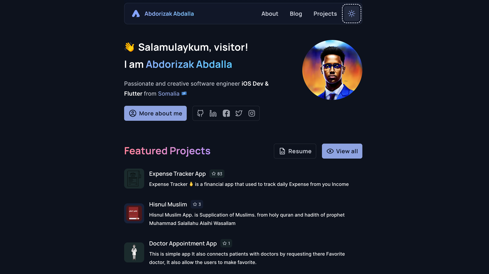

<!-- Logo -->
<p align="center">

</p>

<!-- image -->
<p align="center">
  

## Project Structure

```bash
.
|____config
|____content
|____public
|____scripts
|____src
| |____app
| |____assets
| |____components
| | |____core
| | |____icons
| | |____molecules
| | |____og
| | |____views
| |____data
| |____hooks
| |____lib
| |____providers
| |____styles
| |____types
| |____utils
```

## Running Locally

This application requires Node.js v16.20+.

```bash
git clone https://github.com/abdorizak/abdorizak.dev.git
cd abdorizak.dev
yarn
yarn setup # Remove all of my personal content and files
```

Create a `.env` file similar to [`.env.example`](https://github.com/abdorizak/abdorizak.dev/blob/main/.env.example).

```bash
yarn dev
```
