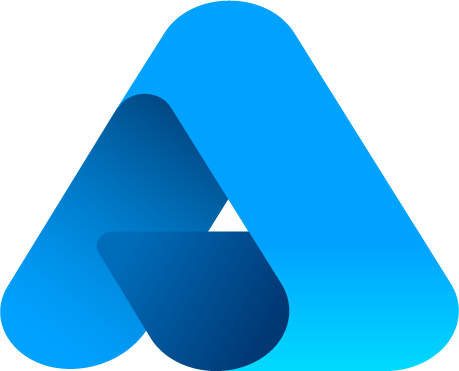
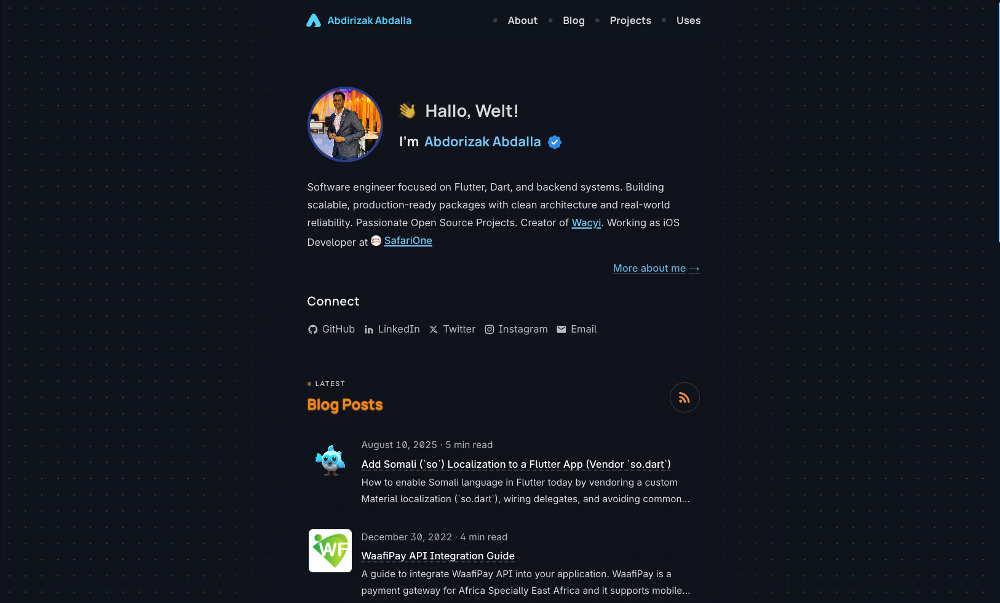

<!-- Logo -->
<p align="center">
  <a href="https://abdorizak.dev" target="_blank">
    
  </a>
</p>

<h1 align="center">abdorizak.dev</h1>

<p align="center">
  Personal portfolio, blog, and playground of <a href="https://abdorizak.dev">Abdirizak Abdalla</a> —
  iOS & Flutter Engineer, Odoo Functional & Technical Consultant from Somalia 🇸🇴.
</p>

<p align="center">
  <a href="https://abdorizak.dev"></a>
  <a href="https://github.com/abdorizak/abdorizak.dev/blob/main/LICENSE"></a>
  
  
  
</p>

<!-- Screenshot -->
<p align="center">
  
</p>

## ✨ Features

- **MDX-powered blog** with syntax-highlighted code blocks (Shiki), auto-generated TOC, reading time, and RSS feed at [`/feed.xml`](https://abdorizak.dev/feed.xml).
- **Dynamic OG images** per page and per blog post.
- **ATS-friendly HTML resume** at [`/resume`](https://abdorizak.dev/resume) — print to PDF for a clean, recruiter-ready CV.
- **Experience timeline** with LinkedIn-style multi-role companies, skill tags, and downloadable attachments.
- **Projects grid** with per-project tech stack chips (colored icons for Go, Next.js, React, Flutter, Swift, Node.js, and more).
- **Dark-first design** with an accent-driven theming system (`--color-accent`) — swap one CSS variable to re-theme the whole site.
- **Polaroid-style about photos**, color-coded nav links, dashed-underline active indicator.
- **Typed content pipeline** via [Velite](https://velite.js.org/) — YAML / MDX → typed JSON the app imports.

## 🛠️ Tech Stack

| Layer     | Tools                                                                                                 |
| --------- | ----------------------------------------------------------------------------------------------------- |
| Framework | [Next.js 14](https://nextjs.org/) (App Router, RSC, Partial Prerender)                                |
| Language  | [TypeScript](https://www.typescriptlang.org/)                                                         |
| Styling   | [Tailwind CSS](https://tailwindcss.com/) · SCSS · [react-twc](https://github.com/gregberge/react-twc) |
| Content   | [Velite](https://velite.js.org/) · MDX · YAML                                                         |
| Fonts     | Inter (body) · Manrope (display) — loaded as variable `woff2` via `next/font/local`                   |
| Runtime   | [Bun](https://bun.sh/)                                                                                |
| Analytics | [Umami](https://umami.is/) (self-hosted)                                                              |
| Deploy    | [Vercel](https://vercel.com/)                                                                         |

## 📂 Project Structure

```
abdorizak.dev
├── config/                # Next.js headers, redirects, Velite collections
├── content/               # MDX blog posts, YAML data (projects, experience, etc.)
├── public/                # Static assets (images, PDFs, OG images)
├── scripts/               # Build-time utility scripts
├── src/
│   ├── app/               # Next.js App Router pages
│   │   ├── (home)/        # Home page and featured sections
│   │   ├── about/         # About page (photos, skills, experience)
│   │   ├── blog/          # Blog index + dynamic post route
│   │   ├── projects/      # Projects index
│   │   ├── resume/        # HTML resume (print-to-PDF)
│   │   └── uses/          # Hardware + software "uses" page
│   ├── assets/            # Fonts, static images imported by code
│   ├── components/
│   │   ├── atoms/         # Link, Img, Icon, Section, etc.
│   │   ├── molecules/     # Header, footer, social links
│   │   └── ui/            # Page-level UI (home intro, blog item, project item…)
│   ├── hooks/             # Reusable client hooks
│   ├── providers/         # Theme / context providers
│   ├── styles/            # Global SCSS, colors, fonts
│   ├── types/             # Ambient TS declarations
│   └── utils/             # Helpers (cx, date, blog, color, metadata, …)
├── tailwind.config.ts
├── next.config.js
└── velite.config.ts
```

## 🚀 Running Locally

Requires [Bun](https://bun.sh/) `>= 1.1` (Node.js `>= 18` also works with `npm`/`pnpm`).

```bash
git clone https://github.com/abdorizak/abdorizak.dev.git
cd abdorizak.dev
bun install
```

Create a `.env` file at the project root (see [`.env.example`](./.env.example) for required keys).

Then start the dev server:

```bash
bun dev
```

Open [`http://localhost:3000`](http://localhost:3000).

### Useful commands

| Command           | What it does                                             |
| ----------------- | -------------------------------------------------------- |
| `bun dev`         | Start dev server (Velite watches `content/` in parallel) |
| `bun run build`   | Full production build (downloads themes → Velite → Next) |
| `bun start`       | Start production server                                  |
| `bun run lint`    | Run ESLint                                               |
| `bun run clean`   | Remove `.next`, `.velite`, `dist`, `out`                 |
| `bun run analyze` | Bundle analyzer (`ANALYZE=true`)                         |

## ✏️ Editing Content

- **Blog posts** — add an `.mdx` file under `content/blog/`. Frontmatter drives title, hero, tags, date.
- **Projects** — append entries to `content/projects.yml`. Supports `stack[]`, `invertOnDark`, `repo`, etc.
- **Experience** — edit `src/components/ui/about/experience/index.tsx` (roles, attachments, company metadata).
- **Resume** — edit `src/app/resume/page.tsx` and `src/app/resume/resume.scss` (print styles included).

## 🙏 Credits

Site architecture is adapted from [jahir.dev](https://jahir.dev) ([source](https://github.com/jahirfiquitiva/jahir.dev)) — huge thanks to [Jahir Fiquitiva](https://github.com/jahirfiquitiva) for open-sourcing the foundation.

## 📄 License

[MIT](./LICENSE) © [Abdirizak Abdalla](https://abdorizak.dev)

---

<p align="center">
  <a href="https://abdorizak.dev">abdorizak.dev</a> ·
  <a href="https://abdorizak.dev/blog">Blog</a> ·
  <a href="https://abdorizak.dev/projects">Projects</a> ·
  <a href="https://abdorizak.dev/resume">Resume</a> ·
  <a href="https://linkedin.com/in/abdorizak">LinkedIn</a> ·
  <a href="https://github.com/abdorizak">GitHub</a>
</p>
